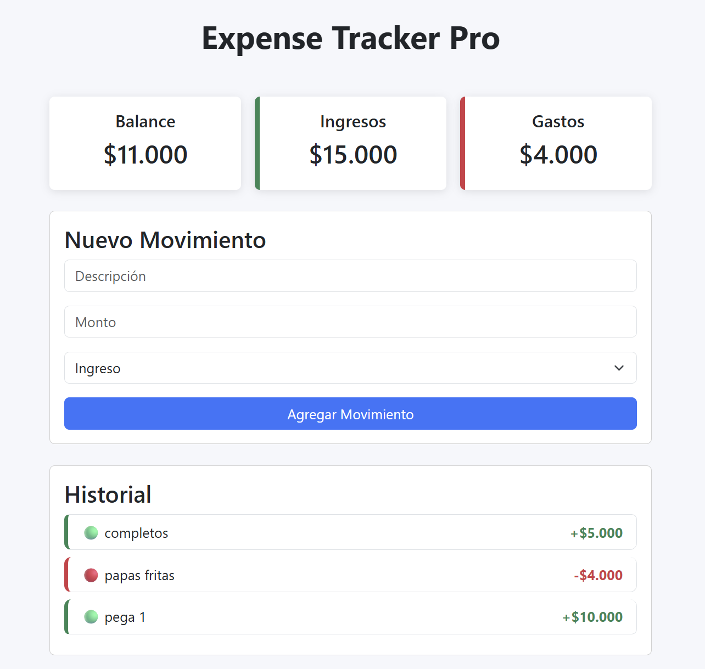

# 💰 Expense Tracker Pro

Aplicación web para la gestión de ingresos y gastos personales desarrollada con JavaScript Vanilla.

Este proyecto permite registrar movimientos financieros, calcular balances automáticamente y almacenar la información localmente utilizando LocalStorage.



---

# 📖 Descripción

Expense Tracker Pro es una aplicación financiera que ayuda a los usuarios a llevar un control simple y visual de sus finanzas personales.

Cada movimiento registrado se almacena localmente en el navegador, permitiendo conservar la información incluso después de cerrar la aplicación.

El objetivo principal de este proyecto es demostrar conocimientos sólidos de:

- JavaScript Vanilla
- Manipulación del DOM
- Eventos
- Funciones
- Objetos y Arrays
- LocalStorage
- Arquitectura modular
- Bootstrap 5
- Diseño Responsive

---

# ✨ Funcionalidades

## 📊 Dashboard Financiero

Visualización automática de:

- Balance total
- Total de ingresos
- Total de gastos

---

## ➕ Registro de Movimientos

Permite agregar:

- Ingresos
- Gastos

Cada movimiento contiene:

- Descripción
- Monto
- Tipo

---

## 📜 Historial de Transacciones

Visualización en tiempo real de todos los movimientos registrados.

### Indicadores visuales

🟢 Ingresos

🔴 Gastos

Además se muestran con colores diferenciados para facilitar la lectura.

---

## 💾 Persistencia de Datos

Los movimientos se almacenan automáticamente mediante:

```javascript
localStorage
```

Esto permite conservar la información incluso al cerrar o actualizar el navegador.

---

## 📱 Diseño Responsive

La aplicación se adapta correctamente a:

- Computadores de escritorio
- Laptops
- Tablets
- Dispositivos móviles

---

# 🛠️ Tecnologías Utilizadas

| Tecnología | Uso |
|------------|-----|
| HTML5 | Estructura |
| CSS3 | Estilos |
| Bootstrap 5 | Diseño Responsive |
| JavaScript ES6+ | Lógica de negocio |
| LocalStorage | Persistencia de datos |
| Git | Control de versiones |
| GitHub | Repositorio remoto |

---

# 📂 Estructura del Proyecto

```text
expense-tracker/
│
├── index.html
│
├── css/
│   └── style.css
│
├── js/
│   ├── app.js
│   ├── storage.js
│   ├── ui.js
│   └── chart.js
│
├── assets/
│   ├── img/
│   └── icons/
│
├── screenshot.png
│
└── README.md
```

---

# 🧠 Arquitectura

La aplicación está separada en módulos para facilitar el mantenimiento.

## app.js

Controlador principal.

Responsable de:

- Capturar eventos
- Crear movimientos
- Actualizar la interfaz
- Coordinar la aplicación

---

## storage.js

Responsable del almacenamiento local.

Funciones:

- Obtener transacciones
- Guardar transacciones

---

## ui.js

Responsable de la interfaz visual.

Funciones:

- Renderizar historial
- Actualizar dashboard
- Mostrar información al usuario

---

## chart.js

Preparado para futuras implementaciones de gráficos y estadísticas.

---

# ⚙️ Instalación

## Clonar repositorio

```bash
git clone https://github.com/helloworldidd/expense-tracker.git
```

---

## Entrar al proyecto

```bash
cd expense-tracker
```

---

## Ejecutar

Abrir:

```text
index.html
```

o utilizar la extensión:

```text
Live Server
```

de Visual Studio Code.

---

# 🚀 Mejoras Futuras

## Funcionalidades

- Editar transacciones
- Eliminar transacciones
- Filtros por categoría
- Filtros por fecha
- Búsqueda de movimientos
- Exportar a PDF
- Exportar a Excel

---

## Visualización

- Dashboard avanzado
- Gráficos con Chart.js
- Indicadores financieros
- Animaciones

---

## Experiencia de Usuario

- Modo oscuro
- Notificaciones visuales
- Confirmación de eliminación
- Validaciones avanzadas

---

# 🎯 Objetivos de Aprendizaje

Este proyecto fue desarrollado para practicar:

- Manipulación del DOM
- Programación orientada a eventos
- Gestión de datos con Arrays
- Objetos JavaScript
- LocalStorage
- Modularización del código
- Buenas prácticas Front-End
- Responsive Design

---

# 📸 Captura de Pantalla


---

# 👨‍💻 Autor

**Patricio Uxuidev**

Desarrollador Front-End.

### GitHub

https://github.com/helloworldidd

---

# 📄 Licencia

Este proyecto está disponible bajo la licencia MIT.

Puedes utilizarlo libremente con fines educativos y de aprendizaje.

---

⭐ Si te gustó este proyecto, considera darle una estrella en GitHub.